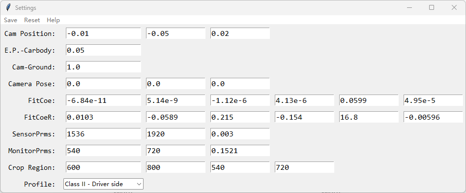

# FOVSim
## 主界面

### 菜单
- Run: 开始视野模拟
- Settings: 打开设置界面

### 图表
- Sensor: 范围表示 Sensor 的分辨率, Regulation points 代表法规点位变换后在 Sensor 上的位置. 红框表示 Monitor 的裁切位置.
- Monitor: 范围表示 Monitor 的分辨率, Regulation points 代表法规点位变换后在 Monitor 是的位置

### 表格
用于表示法规点位在各个步骤中的数据.

## Settings 界面

### 菜单
- Save: 保存当前设置.
- Reset: 通过程序预设的初始值重置.
- Help: 各输入框的详细说明界面.

### 输入框
- Cam Position: 摄像机相对于眼点(E.P.)的坐标. [x, y, z]
- E.P.-Carbody: 眼点相对于车辆的距离的绝对值. (m)
- Cam-Ground: 摄像机安装位置到地面的距离. (m)
- Camera Pose: 摄像机的姿态. (Pitch, Yaw, Roll)
- FitCoe: 正拟合函数 - Real Height vs. Angle. (a5->a0)
- FitCoeR: 反拟合函数 - Angle vs. Real Height. (a5->a0)
- SensorPrms: Sensor 的各参数. [Width, Height, Pixel Size]
- MonitorPrms: Monitor 的各参数. [Width, Height, Pixel Size]
- CropRegion: Monitor 在 Sensor 上裁切的区域. [X_min, Y_min, Width, Height]
- Profile: 用于选择当前的视镜类型以及相机的方位.